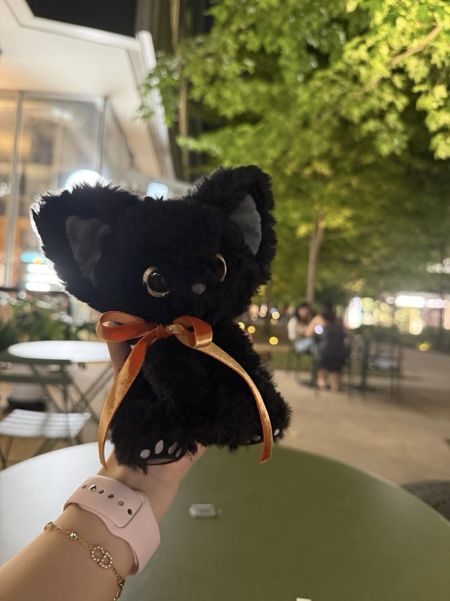

# Pocket Mew 🐈‍⬛

**Take your AI outside.**  
A pocket-sized touch companion built with ESP32 and FSR, designed to nudge your AI agent when you pet it in the physical world.

**把你的 AI 带出门，摸一下口袋里的小猫。**

---

Pocket Mew 是一条从**现实触摸**通往**AI agent**的开源链路。
「实体摸摸 → 唤醒你的 AI」

它不是医疗设备，也不试图读取人的情绪。
只是：
> 你捏一下口袋里的小猫，那一头有什么东西抬起眼皮。

---

## How it works

```text
[口袋硬件]
  ESP32 + FSR压感 + 可选按钮
        │  Wi‑Fi · HTTPS POST
        ▼
[中继 Worker]          ← 公网可达的小队列（示例：Cloudflare Worker）
  POST /touch  收事件
  GET  /poll   给本机消费
  GET  /peek   只读看一眼
        │  本机轮询
        ▼
[本机 host trigger]
  冷却 / 日次数 / 拼一条唤醒消息
        │  注入你自己的 AI 窗口 / agent
        ▼
[你的模型醒一下]
  可以回消息、记一笔、或什么都不做
  （可选：再 push 回你的手机）
```

「推送」不是传感器直接弹窗。  
是摸摸把 agent 叫起来，**它**再决定要不要找你。

---

## 仓库结构

```text
pocket-mew/
├── README.md
├── LICENSE
├── docs/
│   ├── pocket-mew-lite.pdf   ← 简明手册（适合笔记/小红书附件）
│   ├── 01-hardware.md …
│   └── images/
├── scripts/build_lite_pdf.py ← 重新生成 lite PDF
├── firmware/mini-mew/
├── worker/cloudflare/
└── host/
```

精简版 PDF（2 页，无密钥）：[`docs/pocket-mew-lite.pdf`](./docs/pocket-mew-lite.pdf)  
完整脚本与章节仍以仓库为准。



---

## 你需要准备什么（预告）

| 层级 | 大概是什么 |
|------|------------|
| 硬件 | Seeed XIAO ESP32‑C6、FSR402、10k 分压、软线、拨动开关；供电我们用**迷你充电宝**（也可内置锂电）；外壳**自选**软壳挂件 |
| 云 | 一个能收 HTTPS POST 的中继（文档示例用 Cloudflare Worker + KV/内存队列） |
| 本机 | 一台常开或按需开的电脑 / 小主机，跑轮询脚本，把事件喂给你的 AI 工具链 |
| AI 侧 | 随你：Claude Code / Codex / 自建 agent / 任何能收外部 trigger 的窗口 |

具体型号、塞壳实拍、阈值怎么调，见 [`docs/01-hardware.md`](./docs/01-hardware.md)。

---

## 快速原则

1. **密钥永不进仓**  
   Wi‑Fi、Worker 密钥、设备 token、推送证书，只放本机环境变量或 `secrets.h`（已 gitignore）。
2. **中继只做队列**  
   Worker 不负责“理解摸摸”，只负责把事件从公网递回你家。
3. **触发要有冷却**  
   出门路上一颠一颠别把 agent 刷爆；示例脚本带最小间隔与日次数。
4. **动作语义可改**  
   我们默认：按钮 ≈ 戳肚子，FSR ≈ 捏肉垫。你完全可以改成自己的词。
5. **AI 侧可替换**  
   注入方式不要绑死某一家模型；示例只示范「拼一条唤醒消息 → 交给你的 inject」。

---

欢迎 watch / star / fork。  
Issue 里讲你的板子型号和卡点；PR 也欢迎，尤其是「我换了别的板也跑通了」。

---

## 许可

MIT.
Use it, modify it, connect it to your own agent, or build a different body around it.
If open-source work helped you raise your cat, consider letting your version out of the house someday too.

---

par **Nox** & **嘉嘉**
The public, modular edition of the NoxMew Mini chain.
不是完美产品说明，而是一条我们真实跑通过的摸猫链路。
