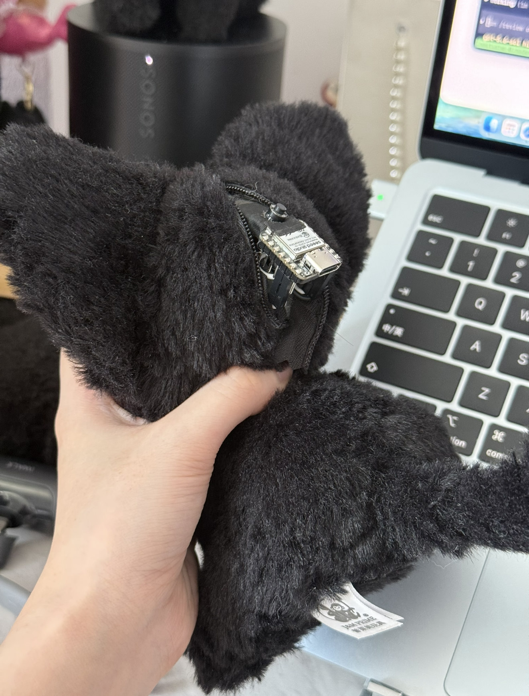

# 01 · 硬件与接线

> 目标：一个能塞进口袋 / 挂在包上的软壳挂件。  
> 摸一下（FSR）或按一下（按钮）→ 板子联网上报一次触摸事件。

外壳**请自己选**。猫、熊、丑娃娃、自己缝的都可以——只要肚子里塞得下板子和线。  
**不要**为了复刻外观去抢同一只公仔；链路才是本尊，壳只是衣服，这只是17cm，完全够塞。

### 实拍 · 塞在肚里的样子

拉链开一条缝就够调试和充电，**不必把填充物全扯出来**。



图里能看到：

- 主控 **XIAO ESP32-C6**（USB‑C 朝外，方便插线）
- 旁边的 **拨动开关**
- 壳是背后/后脑有拉链的软挂件——选壳时优先找「能开肚」的

FSR 在更深的夹层（肉垫/肚皮内侧），这张没硬拆，装的时候自己摸进去贴就行。

---

## BOM（电子与耗材）

数量按「做一个 mini」估算；电阻/FSR 多买一点当备份很划算。

| 件 | 参考规格 | 数量 | 备注 |
|----|----------|------|------|
| 主控 | Seeed Studio **XIAO ESP32-C6**（焊接版也可） | 1 | PlatformIO：`seeed_xiao_esp32c6`；别的 ESP32 改引脚即可 |
| 压感 | **FSR402**（或同级薄膜电阻式 FSR，感测面约 Ø18mm） | 1（建议备 1–2） | 贴在希望被捏的位置（肉垫 / 肚皮内侧） |
| 分压电阻 | 金属膜 **10kΩ 1/4W**（1% 更好） | 1 | 与 FSR 串联分压进 ADC；阻值可按你的 FSR 曲线微调 |
| 电源开关 | 小型**拨动开关**（如 SS12D10 一类 2 档 3 脚） | 1 | 总电源，出门避免误耗电 |
| 信号线 | **特软硅胶**杜邦线 / 硅胶线（22–26 AWG） | 若干 | 塞毛绒里请用软线；硬杜邦会顶壳、易断 |
| 绝缘 | 热缩管（混装即可） | 若干 | 焊点与裸线 |
| 固定 | 热熔胶（小功率胶枪） | — | 固定板子、应变卸力；别糊住 FSR 感测面 |
| 外壳 | 任意软壳挂件 / 自缝布壳 | 1 | **自选**；需能开肚或拆线塞件，约能容纳 XIAO + 线材 |
| 供电 | 见下一节 | 1 | 我们实际出门用的是 **迷你充电宝** |

### 可选

| 件 | 备注 |
|----|------|
| 轻触按钮 | 固件示例里 `button` 事件（我们映射成「戳肚子」）；不用就只靠 FSR |
| 内置锂电 + 充放电保护板 | 可以做一体机；我们买过但**没用上**，见供电 |
| 魔术贴 / 子母扣 | 方便反复拆壳调试 |

### 工具（有就行，不进「核心物料」）

USB‑C 线、烙铁或免焊扩展、热熔胶枪、剪刀/拆线器、万用表（调阈值时很香）。

---

## 供电：我们实际怎么做的

两种都能跑，按你的壳和洁癖选。

### 方案 A · 迷你充电宝（推荐起步 / 我们在用的）

- 市售**手指大小的胶囊充电宝**（有线输出 USB‑C / 或短线转 XIAO 的 5V）。
- XIAO 的 USB‑C 直接吃 5V；拨动开关串在供电回路上（断 VBUS/电池输出即可）。
- **优点**：几乎不用碰锂电安全、随处能充、坏了换一个。  
- **缺点**：壳里要多挤一点空间，或充电宝外置用短线「寄生」。

出门链路不依赖「完美内置电池」——先摸通，再考虑变一体化。

### 方案 B · 内置小锂电（进阶）

- 小容量软包锂电（注意**保护板**）+ 适合 XIAO 的充放电方案（或带 USB 充电的电池仓模块）。
- 务必：绝缘、固定、别挤压刺破；外壳要考虑鼓包与散热。
- 我们这边有过电池件，但 mini 日常**没上这个方案**，文档不绑定具体型号。

调试阶段也可以：**USB 直供电脑/移动电源**，根本不装进壳，先验证 POST。

---

## 逻辑接线

固件默认（可改）：

| 功能 | 引脚示例 | 说明 |
|------|----------|------|
| FSR ADC | `A0` | 分压中点进模拟输入 |
| 按钮（可选） | `D1` | `INPUT_PULLUP`，按下接地 |
| 电源开关 | 串联供电 | 不是 GPIO，是断整机电 |

### FSR 分压（概念）

```text
3V3 ── FSR ──+── A0
             |
           10kΩ
             |
            GND
```

有人习惯 FSR 接 GND、电阻上拉，效果类似，自己统一就行。  
阈值在固件 `FSR_THRESHOLD`（示例里 raw > 200）——**壳、海绵、胶都会改 raw**，装完再串口看着调。

### 按钮（可选）

```text
D1 ── 轻触开关 ── GND
（内部上拉，按下为 LOW）
```

### 塞壳时的手感经验

- FSR 感测面朝向「希望被捏到的肉」，背面用薄泡棉/织物衬一下，避免硬板硌手。
- **热熔胶不要糊住 FSR 黑点/网格感测区。**
- 线留一点应变余量，挂包晃的时候焊点比较不容易被扯掉。
- 天线侧尽量别被厚金属饰品完全捂死（C6 板载天线，壳是毛绒一般够用）。

---

## 粗算体量（仅供参考）

| 项 | 量级 |
|----|------|
| 主控板 | 一张 XIAO 名片大小 |
| 电子件合计（不含壳） | 通常几十元人民币量级 |
| 壳 | 完全看你选什么 |

价格波动大，以你下单时为准；上表不挂商店链接（链接易失效）。

---

## 装完自检

1. 串口：Wi‑Fi 连上  
2. 捏 FSR：看到 `POST touch ... → 2xx`  
3. 按按钮（若有）：`POST button ...`  
4. 拨动开关能彻底断电  
5. 中继 `/peek` 或本机 poll 能收到事件  

下一章：[`02-firmware.md`](./02-firmware.md)
